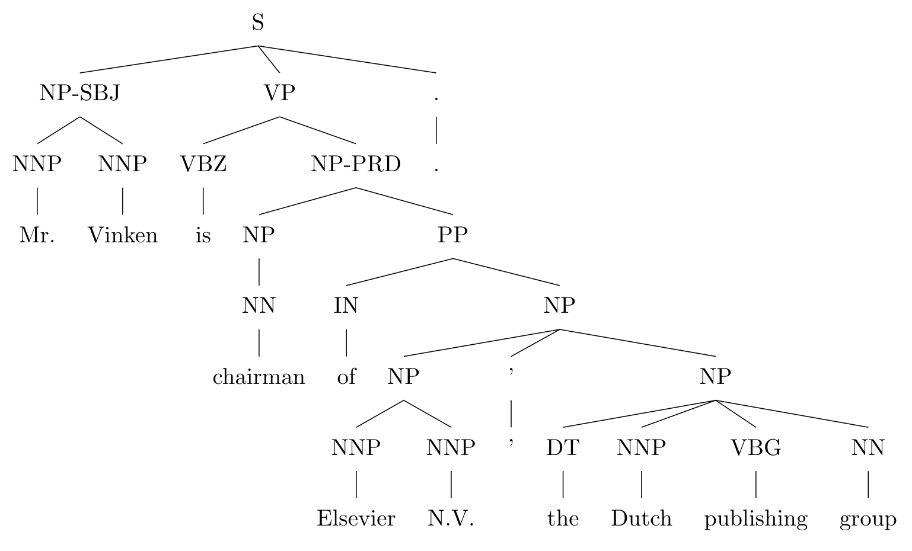
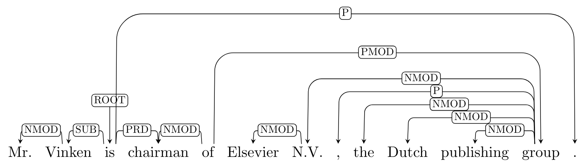
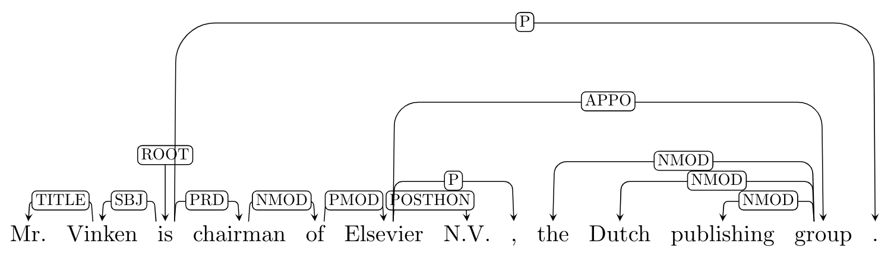
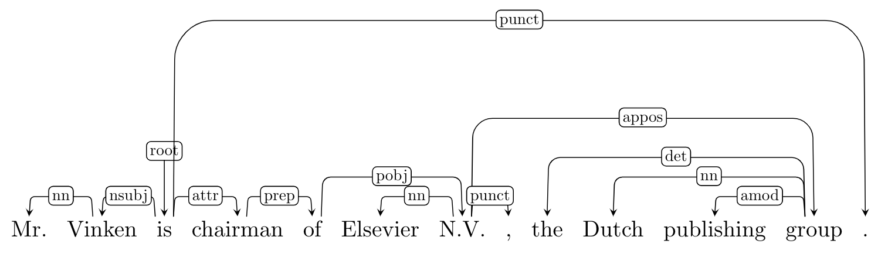
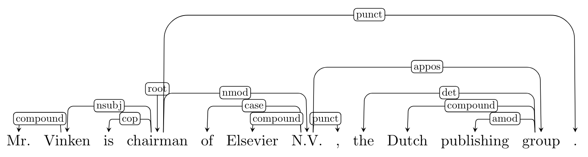

# Introduction

Since dependency structure is not constrained by word order, it is considered to be more domain or language independent than phrase structure. Most current state-of-the-art dependency parsers use a supervised learning approach, which usually requires a large amount of annotated data. For English, there are some manually annotated dependency Treebanks available [^1][^2]. Nonetheless, constituent-based Treebanks such as Penn Treebank are more dominant. Therefore, it is quite natural to built the tools that convert phrase structure to dependency structure.

# Tools

There have been several tools that convert constituent structures to dependency structures. Let's assume that the constituency tree is in the Penn Treebank style as:

- **[Penn2Malt](<https://cl.lingfil.uu.se/~nivre/research/Penn2Malt.html>)** [^3]: it adds semantic dependencies extracted from function tags in the Penn Treebank (e.g., ``LOC``, ``TMP``) and remaps dependencies related to empty categories, producing non-projective dependencies.

- **[LTH](<http://nlp.cs.lth.se/software/treebank_converter/>)** [^4]: it makes use of the extended structure of the new version of the Penn Treebank to derive a more ''semantically useful'' representation.

- **[ClearNLP](<https://github.com/clir/clearnlp-guidelines/blob/master/md/components/dependency_conversion.md>)** [^5]:it generates the Emory style dependency trees as output, where the dependency labels are similar to the [Stanford dependency labels](<https://nlp.stanford.edu/software/stanford-dependencies.shtml>), producing long-distance dependencies by remapping empty categories in constituent trees, and secondary dependencies caused by several linguistic phenomena. For more details about the conversion labels, see [the guideline](<http://www.mathcs.emory.edu/~choi/doc/cu-2012-choi.pdf>) for reference.

- **[Stanford Dependencies](https://nlp.stanford.edu/software/stanford-dependencies.shtml)** [^6]: The Stanford Dependency converter was first introduced in *de Marneffe et al. (2006)*[^7] and then updated according to the [English Universal Dependencies](https://universaldependencies.org/en/index.html) guidelines. Since version 3.5.2 the Stanford Parser and Stanford CoreNLP output grammatical relations in the Universal Dependencies v1 representation by default. They also revisited and extended the dependency graph representations in light of the recent Universal Dependencies initiative and provide a detailed account of an *enhanced* and an *enhanced++* English UD representation.

# Issues when converting to UD
Most of the relations in the Universal Dependencies can be added with syntactic rules. The purely syntactic approach introduced in *Schuster and Manning (2016)* tends to work well in practice but two phenomena require additional consideration, and thus raise some uncertainty during the conversion.

- **Multi-word Expression**: the UD representation defines several multi-word expressions with function words that behave like a single word such as *because of* or *in case*. Extracting the correct structure for these expressions is often challenging because many of these expressions are not a constituent according to the Penn Treebank annotation guidelines [^8].

- **wh-words**: the procedure often attaches wh-words in questions in the wrong head. For example, for the question "What does Peter seem to have?", the procedure would attach "what" to the head of the matrix clause, "seem", instead of the head of the embedded clause, "have". If we were only concerned with converting manually annotated treebanks, we could resolve these ambiguities by making use of the indexed empty nodes in the phrase structure trees. However, the output of most constituency
parsers does not contain these empty nodes.

[^1]: Owen Rambow, Cassandre Creswell, Rachel Szekely, Harriet Taber, and Marilyn Walker. A dependency treebank for english. In Proceedings of LREC’02, 2002.
[^2]:  M. Cmejrek, J. Curín, and J. Havelka. Prague czech-english dependency treebank: Any hopes for a common annotation scheme? In HLT-NAACL’04 workshop on Frontiers in Corpus Annotation, pages 47–54, 2004.
[^3]:Joakim Nivre, Johan Hall, and Jens Nilsson. 2006. MaltParser: A data-driven parser generator for dependency parsing. In Proceedings of LREC2006.
[^4]:Johansson, R., & Nugues, P. 2007. Extended constituent-to-dependency conversion for English. In *Proceedings of the 16th Nordic Conference of Computational Linguistics (NODALIDA 2007)* (pp. 105-112).
[^5]:Choi, J. D., & Palmer, M. 2010. Robust constituent-to-dependency conversion for English. In *Proceedings of the 9th International Workshop on Treebanks and Linguistic Theories (TLT’9)* (pp. 55-66).
[^6]:Schuster, S., & Manning, C. D. 2016. Enhanced English Universal Dependencies: An Improved Representation for Natural Language Understanding Tasks. In LREC (pp. 23-28).
[^7]:de Marneffe, M.-C., MacCartney, B., and Manning, C. D. 2006. Generating typed dependency parses from phrase structure parses. In Proceedings of the Fifth International Conference on Language Resources and Evaluation (LREC-2006).
[^8]:Marcus, M. P., Santorini, B., and Marcinkiewicz, M. A. 1993. Building a large annotated corpus of English: The Penn treebank. Computational Linguistics, 19(2).